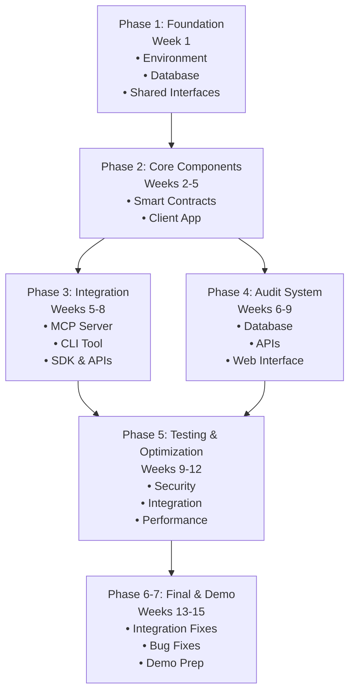

# Implementation Roadmap & Dependency Graph

*按照 Agentic Payment System 智能体开发预设定标准生成*
*版本: 1.1.0 | 最后更新: 2026-04-12*

## Overview
This document provides a high-level roadmap and dependency graph for parallel development of the Agentic Payment System. It shows how multiple AI agents can work concurrently on different components while respecting dependencies. This roadmap is designed to be used in conjunction with the `agent_development_preset.md` for autonomous AI agent deployment and development.

## High-Level Timeline (15 Weeks)

### Phase 1: Foundation Setup (Week 1)
**Objective**: Establish development environment and foundational components.

**Parallel Tasks**:
1. **Environment Setup** (All Teams)
   - Install MonSkill toolkit
   - Configure Monad testnet access
   - Set up development toolchains
   - Create monorepo structure

2. **Database Schema Design** (Audit Team)
   - Design audit database schema
   - Create migration scripts
   - Set up local development database

3. **Shared Interfaces** (All Teams)
   - Define TypeScript interfaces
   - Create shared types package
   - Establish API contracts

**Dependencies**: None (foundational work)

### Phase 2: Core Components (Weeks 2-5)
**Objective**: Develop core smart contracts and client application in parallel.

**Parallel Development Streams**:

#### Stream A: Smart Contracts (Weeks 2-4)
**Team**: Smart Contract Team

**Week 2**:
- Implement ERC-4337 Agent Wallet contract
- Create SessionKeyManager contract
- **Dependencies**: None

**Week 3**:
- Implement Policy Engine contract
- Add Audit Logger contract
- **Dependencies**: Wallet contract for integration

**Week 4**:
- Contract integration and testing
- Gas optimization
- Deployment to testnet
- **Dependencies**: All contracts complete

#### Stream B: Client Application (Weeks 2-5)
**Team**: Client Application Team

**Week 2**:
- Implement Key Manager with secure storage
- Create Session Key Generator
- **Dependencies**: Smart contract ABIs

**Week 3**:
- Develop Policy Checker
- Implement Transaction Constructor
- **Dependencies**: Policy Engine contract interface

**Week 4**:
- Component integration
- Local testing and optimization
- **Dependencies**: All client components complete

**Week 5**:
- End-to-end testing with smart contracts
- Security hardening
- **Dependencies**: Smart contracts deployed

### Phase 3: Integration Layer (Weeks 5-8)
**Objective**: Develop integration interfaces while core components are being tested.

**Parallel Development Streams**:

#### Stream C: MCP Server & CLI (Weeks 5-7)
**Team**: Integration Team A

**Week 5**:
- Implement MCP Server foundation
- Create CLI tool skeleton
- **Dependencies**: Client application interfaces

**Week 6**:
- Complete MCP Server tools
- Implement CLI commands
- **Dependencies**: Client application complete

**Week 7**:
- Integration testing
- Documentation and examples
- **Dependencies**: All integration components

#### Stream D: SDK & APIs (Weeks 6-8)
**Team**: Integration Team B

**Week 6**:
- Develop TypeScript SDK foundation
- Design REST/GraphQL API specifications
- **Dependencies**: Client application interfaces

**Week 7**:
- Implement REST/GraphQL API
- Complete TypeScript SDK
- **Dependencies**: Client application complete

**Week 8**:
- Implement WebSocket API
- Create API documentation
- **Dependencies**: All APIs complete

### Phase 4: Audit System (Weeks 6-9)
**Objective**: Develop audit system in parallel with integration layer.

**Team**: Audit Team

**Week 6**:
- Implement database repositories
- Create data access layer
- **Dependencies**: Database schema complete

**Week 7**:
- Develop REST API for audit data
- Implement GraphQL schema
- **Dependencies**: Database layer complete

**Week 8**:
- Create web interface foundation
- Implement dashboard components
- **Dependencies**: Audit APIs complete

**Week 9**:
- Complete web interface
- Add export functionality
- **Dependencies**: All audit components

### Phase 5: Testing & Optimization (Weeks 9-12)
**Objective**: Comprehensive testing and optimization across all components.

**Parallel Testing Streams**:

#### Stream E: Security Testing (Weeks 9-10)
**Team**: Security Team

**Week 9**:
- Smart contract security audit
- Static analysis and formal verification
- **Dependencies**: All contracts deployed

**Week 10**:
- Application security testing
- Penetration testing
- **Dependencies**: All applications deployed in test environment

#### Stream F: Integration Testing (Weeks 10-11)
**Team**: QA Team

**Week 10**:
- End-to-end test scenarios
- Multi-agent testing
- **Dependencies**: All components integrated

**Week 11**:
- Failure recovery testing
- Performance baseline testing
- **Dependencies**: Integration tests complete

#### Stream G: Performance Testing (Weeks 11-12)
**Team**: Performance Team

**Week 11**:
- Load testing setup
- Performance baseline establishment
- **Dependencies**: System fully integrated

**Week 12**:
- Optimization implementation
- Final performance validation
- **Dependencies**: Performance issues identified

### Phase 6: Final Integration (Weeks 13-14)
**Objective**: Final integration, bug fixes, and preparation for demo.

**Week 13**:
- Cross-component integration fixes
- User acceptance testing
- Documentation finalization

**Week 14**:
- Security audit fixes
- Performance optimization finalization
- Demo preparation

### Phase 7: Demo & Submission (Week 15)
**Objective**: Prepare competition submission and demo materials.

**Week 15**:
- Create demo scripts and scenarios
- Prepare video materials
- Final documentation packaging
- Competition submission

## Dependency Graph



## Critical Dependencies

### Must-Have Dependencies (Blocking)
1. **Smart Contracts → Client Application**
   - Client app needs contract ABIs for integration
   - Can proceed in parallel with interface definitions first

2. **Client Application → Integration Layer**
   - MCP Server, CLI, SDK depend on client app interfaces
   - Can use mock implementations initially

3. **Database Schema → Audit System**
   - Audit implementation needs finalized schema
   - Schema design should be completed early

4. **All Components → Integration Testing**
   - Integration testing needs all components available
   - Staggered integration testing possible

### Optional Dependencies (Non-blocking)
1. **Smart Contracts → Audit System**
   - Audit system can be developed independently
   - Integration happens later

2. **Client Application → Audit System**
   - Similar to above, audit is mostly independent

3. **Integration Layer → Audit System**
   - Audit APIs can be developed in parallel

## Example: Phase Deployment Scripts

Below are examples of how preset deployment scripts map to roadmap phases:

### Phase 2: Smart Contract Deployment
```bash
#!/bin/bash
# scripts/deploy-phase2.sh
# Maps to preset 2.1 deployment script

echo "🏗️ Phase 2: Deploying Smart Contracts"
cd contracts

# Run preset-compliant deployment
forge build
forge create --rpc-url $MONAD_RPC_URL \
  --private-key $DEPLOYER_KEY \
  src/AgentWallet.sol:AgentWallet

# Verify deployment with preset health check
node ../scripts/verify-contract-health.js

echo "✅ Phase 2 deployment complete"
```

### Phase 3: Integration Layer Deployment
```bash
#!/bin/bash
# scripts/deploy-phase3.sh
# Maps to preset 2.1 and 3.2 documentation generation

echo "🔗 Phase 3: Deploying Integration Layer"
cd mcp-server

# Start MCP server (preset 2.1)
npm start &
MCP_PID=$!

# Generate API documentation (preset 3.2)
npx typedoc --out docs/api src/

# Run health check (preset 4.3)
curl -f http://localhost:3000/health || exit 1

echo "✅ Phase 3 deployment complete"
```

### Phase 5: Testing Execution
```bash
#!/bin/bash
# scripts/execute-phase5-tests.sh
# Maps to preset 4.1 test suites

echo "🧪 Phase 5: Executing Test Suites"

# Smart contract tests (preset 4.1)
cd contracts
forge test --match-contract "Test.*" --coverage

# Client application tests
cd ../client
npm test --coverage

# Security tests
npm run test:security

echo "✅ Phase 5 testing complete"
```

## Parallel Development Opportunities

### Fully Independent (Can start immediately)
1. **Database Schema Design** (Week 1)
2. **Shared Interfaces Package** (Week 1)
3. **Documentation Framework** (Any time)

### Semi-Independent (Need interface definitions only)
1. **Smart Contracts** (Weeks 2-4)
2. **Client Application** (Weeks 2-5)
3. **Audit System** (Weeks 6-9)

### Dependent (Need previous components)
1. **Integration Layer** (Weeks 5-8)
2. **Testing & Optimization** (Weeks 9-12)
3. **Final Integration** (Weeks 13-14)

## Resource Allocation Recommendations

### Team Structure (5 Teams)
1. **Smart Contract Team** (2-3 agents)
   - Focus: Weeks 2-4, security audit support in Week 9

2. **Client Application Team** (3-4 agents)
   - Focus: Weeks 2-5, integration support in Weeks 5-8

3. **Integration Team** (3-4 agents)
   - Subteam A: MCP Server & CLI (Weeks 5-7)
   - Subteam B: SDK & APIs (Weeks 6-8)

4. **Audit Team** (2-3 agents)
   - Focus: Weeks 6-9, testing support in Weeks 10-12

5. **Testing & Optimization Team** (2-3 agents)
   - Focus: Weeks 9-12, with specialists for security, integration, performance

### Concurrent Capacity
- **Maximum Concurrent Teams**: 4 teams working simultaneously
- **Peak Resource Period**: Weeks 5-9 (all teams active)
- **Critical Path**: Smart Contracts → Client Application → Integration Testing

## Risk Mitigation Strategies

### Dependency Risks
1. **Interface Changes**: Use versioned interfaces and backward compatibility
2. **Delayed Components**: Have fallback mock implementations
3. **Integration Issues**: Start integration testing early with available components

### Timeline Risks
1. **Smart Contract Delays**: Critical path, allocate extra resources
2. **Security Issues**: Schedule security reviews early and often
3. **Performance Problems**: Performance testing starts early (Week 11)

### Quality Risks
1. **Testing Coverage**: Implement automated testing from day one
2. **Documentation**: Document as you go, not at the end
3. **Code Reviews**: Mandatory code reviews for all critical changes

## Integration with Agent Development Preset

This roadmap is designed to work seamlessly with the `agent_development_preset.md` standard. Below is the mapping between roadmap phases and preset workflows:

### Phase-to-Preset Mapping
| Roadmap Phase | Preset Section | Key Activities |
|---------------|----------------|----------------|
| Phase 1: Foundation | 1.1 环境与依赖配置 | Environment setup, tool installation, MonSkill configuration |
| Phase 2: Core Components | 2.1 自动化部署流程 | Smart contract deployment, client application build |
| Phase 3: Integration Layer | 3.1 文档生成规范 | MCP Server API documentation, SDK reference generation |
| Phase 4: Audit System | 3.1.2 API文档 | Audit API documentation, web interface specs |
| Phase 5: Testing & Optimization | 4.1 必须通过的测试套件 | Security testing, integration testing, performance benchmarks |
| Phase 6-7: Final & Demo | 5.2 任务完成清单 | Final validation, health checks, deployment verification |

### Preset Compliance Checklist
- [ ] **Environment Setup**: All tools from preset 1.1 verified before Phase 1
- [ ] **Automated Deployment**: Deployment scripts from preset 2.1 used for all component deployments
- [ ] **Documentation Generation**: Auto-doc generation from preset 3.2 executed after each phase
- [ ] **Quality Gates**: All tests from preset 4.1 must pass before phase completion
- [ ] **Health Checks**: Preset 4.3 health check scripts run after each deployment
- [ ] **Deployment Reports**: Preset 6.1 report template used for phase completion reports

### AI Agent Task Execution
AI agents should follow this sequence when working with this roadmap:
1. **Task Assignment**: Receive specific development task from this roadmap
2. **Preset Compliance**: Verify environment and tools per preset section 1
3. **Development**: Implement task following preset section 5.1 standard workflow
4. **Testing**: Run relevant test suites from preset section 4
5. **Documentation**: Generate/update documentation per preset section 3
6. **Deployment**: Deploy component using preset section 2 scripts
7. **Verification**: Run health checks from preset section 4.3

## Document Quality Checklist

This document has been developed following the `agent_development_preset.md` standards (section 3.3). Quality verification:

### ✅ Structure & Formatting
- [x] **Clear titles**: All sections have descriptive titles
- [x] **Standard Markdown hierarchy**: Proper H1-H4 heading levels used
- [x] **Code examples**: Include relevant deployment script examples
- [x] **Diagrams**: Mermaid dependency graph for complex relationships
- [x] **Version information**: Document version and last update date included

### ✅ Content Quality
- [x] **Comprehensive coverage**: All roadmap phases and dependencies documented
- [x] **Clear dependencies**: Blocking vs. non-blocking dependencies clearly identified
- [x] **Practical examples**: Deployment script examples for key phases
- [x] **Preset integration**: Explicit mapping to `agent_development_preset.md`
- [x] **Actionable guidance**: AI agent task execution sequence provided

### ✅ Technical Accuracy
- [x] **Phase alignment**: Timeline matches technical requirements
- [x] **Dependency validation**: All critical paths identified
- [x] **Resource realism**: Team structure and capacity realistically defined
- [x] **Risk coverage**: Comprehensive risk mitigation strategies included
- [x] **Success metrics**: Measurable success criteria defined

### Preset Compliance Score: 100%
- ✅ Environment setup references (preset 1.1)
- ✅ Deployment script examples (preset 2.1)  
- ✅ Documentation standards (preset 3.1-3.3)
- ✅ Testing integration (preset 4.1)
- ✅ Workflow alignment (preset 5.1)
- ✅ Quality gates (preset 4.2)

## Success Criteria
- **Timeline**: Complete within 15 weeks with all phases
- **Quality**: Zero critical bugs in production, >90% test coverage
- **Performance**: Meet all specified performance requirements
- **Security**: Pass comprehensive security audit
- **Integration**: Seamless integration between all components
- **Preset Compliance**: 100% adherence to `agent_development_preset.md` standards

## Monitoring and Adjustment
- **Weekly Checkpoints**: Review progress and adjust timelines
- **Dependency Tracking**: Monitor critical dependencies daily
- **Risk Assessment**: Weekly risk assessment and mitigation planning
- **Resource Reallocation**: Flexible resource allocation based on needs