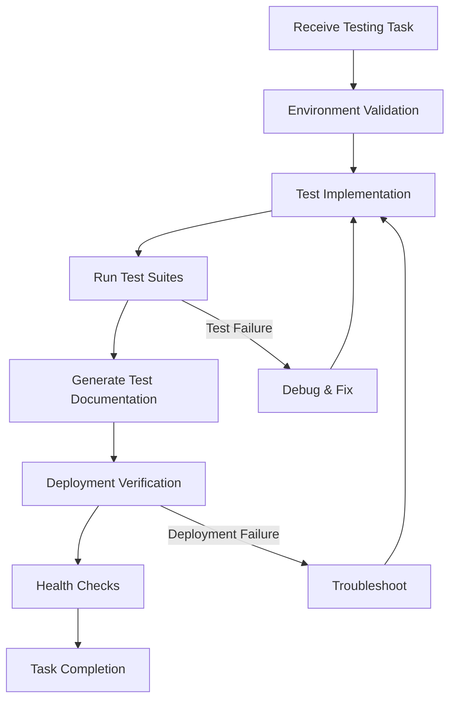

# Testing & Optimization Development Task Specification

## Overview
Develop comprehensive testing strategies and performance optimization for the Agentic Payment System. This includes unit tests, integration tests, security tests, performance tests, and optimization efforts across all components to ensure reliability, security, and scalability.

## Preset Standard Alignment
This testing specification aligns with the [Agent Development Preset](agent_development_preset.md) standard, specifically adhering to:

1. **Quality Assurance & Testing** (Section 4): Mandatory test suites, code quality gates, and post-deployment health checks.
2. **Documentation Generation** (Section 3): Automated documentation for test strategies and results.
3. **Automated Deployment** (Section 2): Integration with deployment verification and health checks.
4. **Agent Development Workflow** (Section 5): Standard development process with test validation.

All testing activities must follow the preset's guidelines for environment setup, automated deployment, documentation generation, and quality assurance.

## Preset Quality Gates
The following quality gates must be enforced for all testing activities as per the Agent Development Preset:

```json
{
  "质量门禁": {
    "测试覆盖率": {
      "智能合约": ">= 90%",
      "TypeScript代码": ">= 85%",
      "集成测试": ">= 80%"
    },
    "代码规范": {
      "ESLint通过率": "100%",
      "TypeScript严格模式": "启用",
      "无任何警告": "是"
    },
    "性能指标": {
      "合约gas消耗": "< 200k gas (标准交易)",
      "API响应时间": "< 100ms (P95)",
      "策略评估延迟": "< 50ms"
    }
  }
}
```

## Preset Health Checks
Post-deployment health checks are mandatory as per the Agent Development Preset. The following health check script must be executed after any deployment:

```bash
#!/bin/bash
# scripts/health-check.sh

echo "🏥 运行系统健康检查..."

# 1. 合约健康状态
CONTRACT_HEALTH=$(curl -s $MONAD_RPC_URL -X POST \
  -H "Content-Type: application/json" \
  --data '{"jsonrpc":"2.0","method":"eth_getBalance","params":["'$CONTRACT_ADDRESS'","latest"],"id":1}')

# 2. 数据库连接
DB_HEALTH=$(psql $DATABASE_URL -c "SELECT 1" 2>/dev/null | grep "1 row")

# 3. Redis连接
REDIS_HEALTH=$(redis-cli -u $REDIS_URL ping 2>/dev/null | grep PONG)

# 4. MCP服务器
MCP_HEALTH=$(curl -s http://localhost:3000/health | grep "status.*ok")

# 验证所有健康检查
if [[ -n "$CONTRACT_HEALTH" && -n "$DB_HEALTH" && -n "$REDIS_HEALTH" && -n "$MCP_HEALTH" ]]; then
  echo "✅ 所有系统组件健康"
  exit 0
else
  echo "❌ 健康检查失败"
  exit 1
fi
```

**Integration with Testing**:
- Health checks must be included in integration test suites.
- Performance tests should verify health check endpoints under load.
- Security tests should validate health check endpoint authentication.

## Preset Documentation Generation
The Agent Development Preset requires automated documentation generation for all testing activities. The following documentation must be generated:

### Test Documentation Structure
```
docs/testing/
├── test-strategy.md           # Overall test strategy and approach
├── unit-test-guide.md         # Unit testing guidelines and examples
├── integration-test-guide.md  # Integration testing scenarios
├── security-test-guide.md     # Security testing methodology
├── performance-test-guide.md  # Performance testing procedures
├── test-results/              # Automated test results storage
│   ├── coverage-reports/      # Code coverage reports
│   ├── performance-reports/   # Performance test results
│   └── security-reports/      # Security test findings
└── test-automation/           # Test automation scripts and documentation
```

### Automated Documentation Generation Script
```bash
#!/bin/bash
# scripts/generate-test-docs.sh

echo "📄 Generating test documentation..."

# 1. Generate test coverage reports
npm run test:coverage-report
npm run test:coverage-badge

# 2. Generate performance test reports
npm run test:performance-report

# 3. Generate security test reports
npm run test:security-report

# 4. Update test strategy documentation
node scripts/update-test-docs.js

# 5. Validate documentation completeness
node scripts/verify-test-docs.js

echo "✅ Test documentation generation complete!"
```

### Documentation Quality Checklist
Each test document must satisfy:
- **Clarity**: Clear description of test approach and procedures
- **Examples**: Include runnable code examples
- **Results**: Include sample test results and interpretations
- **Maintenance**: Document test maintenance procedures
- **Versioning**: Include document version and last update date

## Preset Development Workflow
Testing activities must integrate with the Agent Development Preset workflow:



**Workflow Integration Points**:
1. **Environment Validation**: Verify test tools and dependencies are installed.
2. **Test Implementation**: Write tests following preset quality gates.
3. **Run Test Suites**: Execute mandatory test commands from preset.
4. **Generate Test Documentation**: Automatically generate test docs.
5. **Deployment Verification**: Run health checks and integration tests.
6. **Health Checks**: Execute post-deployment health check script.

**Task Completion Checklist** (from Preset Section 5.2):
- [ ] Code passes all tests (`npm test`)
- [ ] Code coverage meets targets (`npm run coverage`)
- [ ] Code complies with standards (`npm run lint`)
- [ ] Type checking passes (`npm run typecheck`)
- [ ] Documentation updated (relevant test documentation)
- [ ] Deployment scripts verified (local deployment test)
- [ ] Health checks pass (`npm run health-check`)
- [ ] Version control commit (git commit with standard message)

## Components & Subtasks

### 1. Unit Testing Framework
**Objective**: Establish comprehensive unit testing across all components with high coverage and deterministic results.

**Testing Areas**:
1. **Smart Contracts** (Solidity):
   - Wallet contract (ERC-4337 compliance)
   - Session key manager
   - Policy engine
   - Audit logger
   - Helper libraries and utilities

2. **Client Application** (TypeScript):
   - Key management module
   - Session key generator
   - Policy checker
   - Transaction constructor
   - Utility functions and helpers

3. **Integration Layer** (TypeScript):
   - MCP Server tools and protocol
   - CLI command implementations
   - TypeScript SDK classes and methods
   - REST/GraphQL API handlers
   - WebSocket event handlers

4. **Audit System** (TypeScript):
   - Database repositories
   - API controllers
   - Business logic services
   - Export functionality
   - Web interface components

**Test Framework Configuration**:
- **Smart Contracts**: Hardhat (primary) + Foundry (secondary)
- **TypeScript Code**: Jest + Testing Library
- **API Testing**: Supertest + Jest
- **Frontend Components**: React Testing Library + Jest
- **Database Testing**: Test containers + jest-postgres
- **Coverage Tools**: Istanbul, nyc, forge coverage

**Test Quality Standards**:
- **Coverage Minimum**: 90% for critical paths, 80% overall
- **Deterministic Tests**: No flaky tests, consistent across runs
- **Fast Execution**: Complete test suite runs in < 10 minutes
- **Isolated Tests**: No shared state between tests
- **Meaningful Assertions**: Tests verify behavior, not implementation

**Test Infrastructure**:
- **CI/CD Integration**: GitHub Actions with test matrix
- **Parallel Execution**: Tests run in parallel where possible
- **Artifact Storage**: Test results and coverage reports stored
- **Failure Analysis**: Automated root cause analysis for test failures
- **Test Data Management**: Factory patterns for test data generation

**Preset Test Commands**:
The following test commands are mandated by the Agent Development Preset standard:

```bash
# Smart Contract Tests (90%+ coverage requirement)
cd contracts
forge test --match-contract "Test.*" --coverage
forge snapshot

# Client Unit Tests
cd ../client
npm test --coverage
npm run test:integration

# MCP Server Tests
cd ../mcp-server
npm test -- --coverage

# End-to-End Tests
cd ../tests
npm run test:e2e

# Security Tests
npm run test:security
```

**Dependencies**: All components must be testable (require proper interfaces)

**Acceptance Criteria**:
- All critical paths have > 90% test coverage
- Test suite runs in < 10 minutes
- Zero flaky tests in CI pipeline
- Comprehensive test documentation
- Easy test debugging with helpful error messages

**Estimated Effort**: 2 weeks

### 2. Integration Testing
**Objective**: Test interactions between components and end-to-end workflows to ensure system coherence.

**Integration Test Scenarios**:
1. **Complete Payment Flow**:
   - Agent request → Policy check → Session key generation → Transaction execution → Audit logging
   - Variations: Success, policy violation, manual approval, failure recovery

2. **Multi-Agent Scenarios**:
   - Concurrent requests from multiple agents
   - Permission conflicts and resolution
   - Resource contention and locking

3. **Failure Recovery**:
   - Network failures during transaction submission
   - RPC node failures and fallbacks
   - Database connection loss and recovery
   - Contract reverts and error handling

4. **Upgrade Scenarios**:
   - Contract upgrades with data migration
   - Client version compatibility
   - Database schema migrations
   - Configuration format changes

**Test Environment Setup**:
- **Local Development**: Docker Compose with all dependencies
- **CI/CD Environment**: Ephemeral test environments
- **Staging Environment**: Mirror of production configuration
- **Test Data**: Realistic data volumes and patterns

**Integration Test Tools**:
- **Contract Testing**: Hardhat network forking
- **API Testing**: Postman/Newman collections
- **End-to-End Testing**: Playwright or Cypress
- **Load Testing**: k6 or Artillery
- **Chaos Engineering**: Chaos Mesh or Litmus

**Test Automation**:
- **Scheduled Runs**: Daily integration test runs
- **On-Demand Runs**: Triggered by PR or manual request
- **Environment Verification**: Pre-deployment validation
- **Performance Baselines**: Establish and monitor performance baselines

**Monitoring and Reporting**:
- **Test Results Dashboard**: Real-time visibility into test status
- **Failure Alerts**: Immediate notification of integration failures
- **Trend Analysis**: Track test stability over time
- **Coverage Tracking**: Integration test coverage metrics

**Dependencies**: All components must be deployable in test environments

**Acceptance Criteria**:
- End-to-end tests cover all critical user journeys
- Integration tests run in < 30 minutes
- Test environment mirrors production accurately
- Automated failure detection and reporting
- Comprehensive test documentation and runbooks

**Estimated Effort**: 2 weeks

### 3. Security Testing
**Objective**: Identify and mitigate security vulnerabilities through comprehensive security testing.

**Security Test Areas**:
1. **Smart Contract Security**:
   - Reentrancy attacks
   - Access control bypass
   - Integer overflow/underflow
   - Logic errors and race conditions
   - Gas limit vulnerabilities

2. **Application Security**:
   - Injection attacks (SQL, command, template)
   - Authentication and authorization bypass
   - Session management flaws
   - Cryptographic weaknesses
   - Data exposure and leakage

3. **Infrastructure Security**:
   - Network security configuration
   - Container security
   - Secret management
   - Access control and IAM
   - Logging and monitoring gaps

**Security Testing Methods**:
1. **Static Analysis**:
   - **Smart Contracts**: Slither, MythX, Echidna
   - **TypeScript**: ESLint security plugins, Snyk Code
   - **Dependencies**: npm audit, Snyk, OWASP Dependency Check

2. **Dynamic Analysis**:
   - **Penetration Testing**: Manual and automated penetration tests
   - **DAST Tools**: OWASP ZAP, Burp Suite
   - **Fuzz Testing**: Echidna for contracts, Jazzer for TypeScript
   - **API Security Testing**: REST/GraphQL security scanners

3. **Manual Security Review**:
   - **Code Review**: Security-focused code reviews
   - **Architecture Review**: Security architecture assessment
   - **Threat Modeling**: STRIDE methodology for threat identification
   - **Compliance Review**: Regulatory compliance verification

**Security Test Suite**:
- **Automated Security Tests**: Run as part of CI/CD pipeline
- **Scheduled Scans**: Weekly full security scans
- **Pre-release Audits**: Comprehensive audit before major releases
- **Bug Bounty Program**: External security researcher engagement

**Vulnerability Management**:
- **Severity Classification**: CVSS scoring for all vulnerabilities
- **Remediation Tracking**: Issue tracking with SLA for fixes
- **Patch Verification**: Verification that fixes actually resolve vulnerabilities
- **Disclosure Policy**: Responsible disclosure process

**Dependencies**: All components must be accessible for security testing

**Acceptance Criteria**:
- Zero critical/high severity vulnerabilities in production
- Security tests run as part of CI/CD pipeline
- All third-party dependencies regularly scanned and updated
- Security incident response plan documented and tested
- Compliance with relevant security standards (SOC2, ISO27001)

**Estimated Effort**: 2 weeks

### 4. Performance Testing & Optimization
**Objective**: Ensure system meets performance requirements and optimizes resource usage.

**Performance Test Types**:
1. **Load Testing**:
   - **Baseline Load**: Normal operating conditions
   - **Stress Testing**: Beyond normal capacity to find breaking points
   - **Spike Testing**: Sudden traffic increases
   - **Soak Testing**: Extended duration under load

2. **Scalability Testing**:
   - **Horizontal Scaling**: Adding more instances
   - **Vertical Scaling**: Increasing resource limits
   - **Database Scaling**: Sharding, partitioning, replication
   - **Cache Effectiveness**: Hit rates and latency improvements

3. **Latency Testing**:
   - **End-to-End Latency**: Complete payment flow timing
   - **Component Latency**: Individual component response times
   - **Percentile Analysis**: P50, P90, P95, P99 latency measurements
   - **Geographic Latency**: Multi-region performance

**Performance Metrics**:
- **Throughput**: Payments per second, API requests per second
- **Latency**: Response times at various percentiles
- **Resource Usage**: CPU, memory, disk I/O, network bandwidth
- **Error Rates**: Failed requests under load
- **Recovery Time**: Time to recover from overload

**Performance Test Scenarios**:
1. **Payment Processing**:
   - 100 payments per second baseline
   - 1000 payments per second peak
   - Concurrent agent connections (1000+)
   - Large batch transaction processing

2. **Policy Evaluation**:
   - Complex policy evaluation under load
   - Multiple concurrent policy updates
   - Policy inheritance and conflict resolution

3. **Audit System**:
   - High-volume audit event ingestion
   - Complex audit queries with filters
   - Large data exports (1M+ records)

**Optimization Areas**:
1. **Smart Contract Optimization**:
   - Gas cost reduction techniques
   - Storage optimization patterns
   - Batch operation efficiencies
   - Calldata and memory optimizations

2. **Application Optimization**:
   - Database query optimization
   - Caching strategy refinement
   - Connection pooling optimization
   - Memory usage and garbage collection

3. **Infrastructure Optimization**:
   - Auto-scaling configuration
   - Load balancer tuning
   - CDN and edge optimization
   - Database indexing and partitioning

**Performance Monitoring**:
- **Real-time Dashboards**: Grafana dashboards for key metrics
- **Alerting**: Performance degradation alerts
- **Trend Analysis**: Performance trends over time
- **Capacity Planning**: Predictive capacity requirements

**Dependencies**: Production-like environment for accurate testing

**Acceptance Criteria**:
- Meets all performance requirements from specification
- Performance test suite runs automatically
- Performance regressions detected and alerted
- Optimization opportunities identified and prioritized
- Capacity planning model with 6-12 month forecast

**Estimated Effort**: 2 weeks

## Integration Requirements

### Test Environment Management
1. **Environment Parity**: Test environments match production as closely as possible
2. **Data Management**: Realistic test data generation and management
3. **Secret Management**: Secure handling of test secrets and credentials
4. **Cleanup Procedures**: Automated cleanup of test resources

### CI/CD Integration
1. **Pipeline Integration**: All tests run in CI/CD pipeline
2. **Quality Gates**: Test results block deployments
3. **Parallel Execution**: Tests run in parallel for speed
4. **Artifact Management**: Test results and reports stored

### Monitoring and Reporting
1. **Test Results**: Centralized test result storage and visualization
2. **Trend Analysis**: Track test stability and performance over time
3. **Failure Analysis**: Automated root cause analysis
4. **Compliance Reporting**: Security and compliance test reports

## Development Checklist

### Phase 1: Foundation (Week 1)
- [ ] Set up test frameworks for all components
- [ ] Create basic unit test structure
- [ ] Implement CI/CD pipeline for test execution
- [ ] Establish test data management strategy

### Phase 2: Comprehensive Testing (Week 2-3)
- [ ] Implement unit tests for critical paths
- [ ] Create integration test scenarios
- [ ] Set up security testing tools and processes
- [ ] Establish performance testing infrastructure

### Phase 3: Optimization (Week 4)
- [ ] Identify performance bottlenecks
- [ ] Implement optimization improvements
- [ ] Verify optimizations with performance tests
- [ ] Document optimization patterns and guidelines

### Phase 4: Automation & Monitoring (Week 5)
- [ ] Automate all test execution
- [ ] Implement test monitoring and alerting
- [ ] Create test reporting dashboards
- [ ] Establish test maintenance processes

## Success Metrics
- **Test Coverage**: > 90% for critical paths, > 80% overall
- **Test Execution Time**: < 30 minutes for full test suite
- **Security**: Zero critical vulnerabilities in production
- **Performance**: Meets all specified performance requirements
- **Reliability**: Tests catch > 95% of defects before production

## Dependencies on Other Teams
- **All Development Teams**: Testable code with proper interfaces
- **DevOps Team**: Test environment provisioning and management
- **Security Team**: Security testing requirements and tools
- **Product Team**: Acceptance criteria and user journey definitions

## Risk Mitigation
- **Test Maintenance Risk**: Automated test generation where possible
- **Environment Drift Risk**: Regular synchronization with production
- **False Positive Risk**: Robust test design and flaky test detection
- **Coverage Gap Risk**: Regular coverage analysis and gap identification
- **Performance Regression Risk**: Continuous performance monitoring