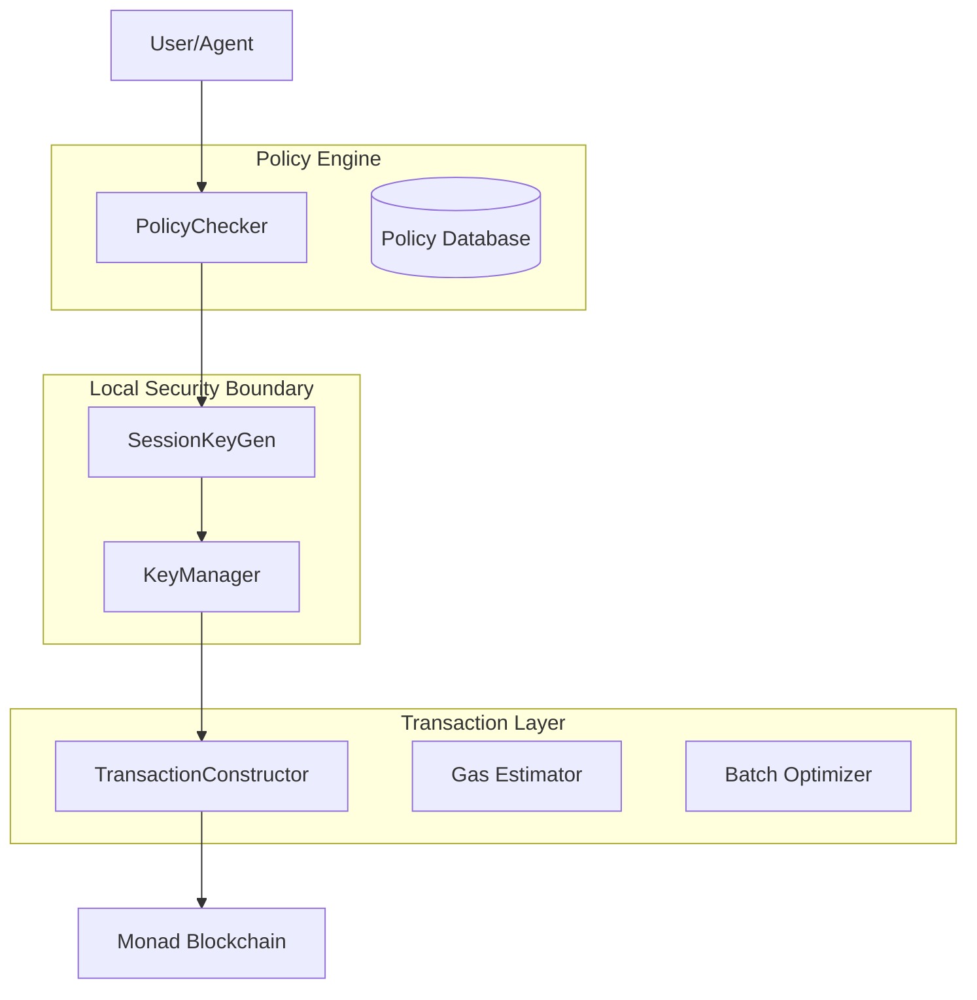

# Client Application Architecture

## Overview
The Agentic Payment System client is a local application that securely manages user keys, generates session keys for AI Agents, evaluates security policies, and constructs blockchain transactions. It ensures private keys never leave the user's device while enabling secure, policy-controlled payments.

## Architecture Diagram

## Component Responsibilities

### 1. Key Manager
- **Purpose**: Secure management of master private keys
- **Security Model**: OS keychain storage, hardware wallet integration, memory isolation
- **Key Functions**:
  - Wallet initialization (create/import)
  - Transaction signing (isolated context)
  - Key backup/restore (encrypted)
  - Key rotation and migration

### 2. Session Key Generator
- **Purpose**: Create temporary, limited-authority keys for AI Agents
- **Security Model**: Memory-only storage, automatic expiry, permission encoding
- **Key Functions**:
  - Generate session key pairs with encoded permissions
  - Validate session key validity and limits
  - Immediate revocation (local + on-chain)
  - Automated rotation based on usage/time

### 3. Policy Checker
- **Purpose**: Evaluate payment requests against user-configured security policies
- **Security Model**: Rule-based engine with real-time evaluation
- **Key Functions**:
  - Policy evaluation against payment requests
  - Budget tracking across time periods
  - Recipient whitelist/blacklist validation
  - Manual approval requirement determination
  - Policy simulation for UI feedback

### 4. Transaction Constructor
- **Purpose**: Build optimized transactions for Monad blockchain
- **Optimization Focus**: Gas estimation, fee optimization, batch processing
- **Key Functions**:
  - Transaction building with proper encoding
  - Accurate gas estimation for Monad-specific opcodes
  - ERC-4337 UserOperation creation
  - Batch transaction optimization
  - Fee optimization (EIP-1559, priority fees)

## Data Flow

### Payment Request Processing
1. **Agent Request**: AI Agent submits payment request with context
2. **Policy Evaluation**: PolicyChecker validates against all active policies
3. **Session Key Creation**: If approved, generate session key with appropriate permissions
4. **Transaction Building**: Construct transaction with session key signature
5. **Broadcast**: Send to Monad blockchain via RPC

### Security Enforcement Points
- **Key Isolation**: Private keys never exposed to JavaScript runtime
- **Permission Encoding**: Session keys have encoded limits (amount, recipients, expiry)
- **Policy Evaluation**: Every request evaluated before any key operation
- **Audit Logging**: All actions logged locally and on-chain

## Storage Architecture

### Local Storage
- **Key Storage**: OS keychain (primary), encrypted file (fallback)
- **Policy Database**: SQLite with encrypted storage
- **Session Key Cache**: Memory-only, periodic cleanup
- **Transaction History**: Local cache + on-chain audit trail

### Security Boundaries
- **Trusted Computing Base**: OS keychain, hardware wallet firmware
- **Application Security**: Memory isolation, zero key exposure
- **Network Security**: TLS for RPC connections, signature verification

## Integration Points

### External Dependencies
- **Monad Blockchain**: RPC nodes for transaction submission
- **MPP SDK**: Monad Payment Protocol SDK for blockchain interactions
- **Hardware Wallets**: Ledger, Trezor, Keystone via Web3Auth/WalletConnect
- **MCP Server**: Model Context Protocol server for AI Agent integration

### Internal Interfaces
- **Component APIs**: Clean TypeScript interfaces between components
- **Event System**: Pub/Sub for component communication
- **Configuration**: JSON/YAML configuration with schema validation

## Performance Characteristics

### Key Metrics
- **Key Retrieval**: < 100ms (OS keychain)
- **Session Key Generation**: < 50ms
- **Policy Evaluation**: < 10ms for 100 policies
- **Transaction Construction**: < 100ms
- **End-to-End Flow**: < 2 seconds

### Scalability
- **Concurrent Sessions**: 1000+ session keys per user
- **Policy Complexity**: Support for nested boolean logic
- **Transaction Throughput**: 10+ concurrent transaction building

## Security Model

### Threat Mitigation
- **Key Extraction**: Memory isolation, zeroization, hardware protection
- **Unauthorized Payments**: Policy enforcement, session key limits
- **Replay Attacks**: Nonce management, expiry enforcement
- **Phishing**: Hardware wallet verification, domain binding

### Compliance
- **OWASP ASVS Level 2**: All security requirements met
- **GDPR**: Local data processing, user consent
- **Financial Regulations**: Audit trails, transaction limits

---

*Document Version: 1.0.0*  
*Last Updated: 2024-01-01*  
*Maintained By: AI Agent (autonomous documentation)*